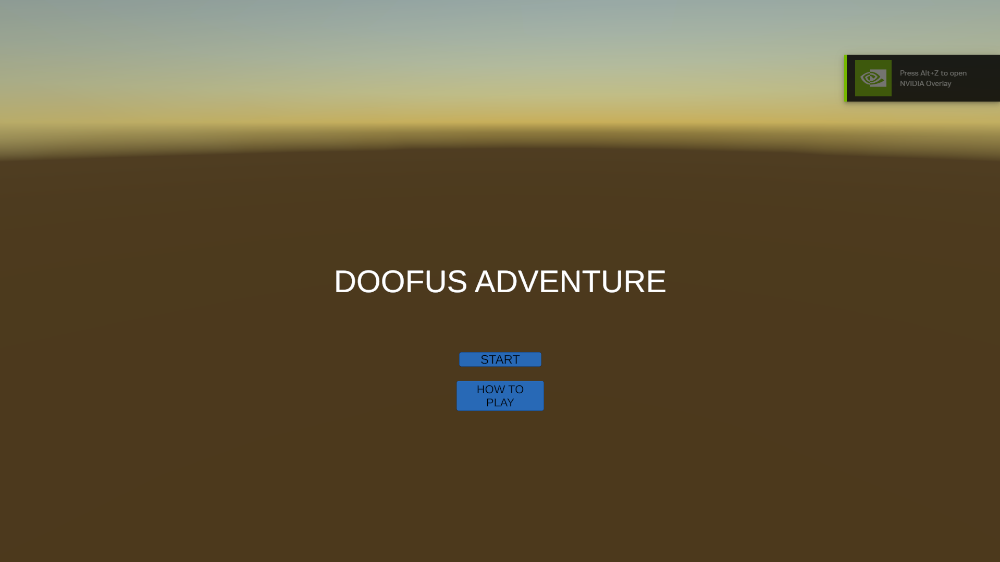
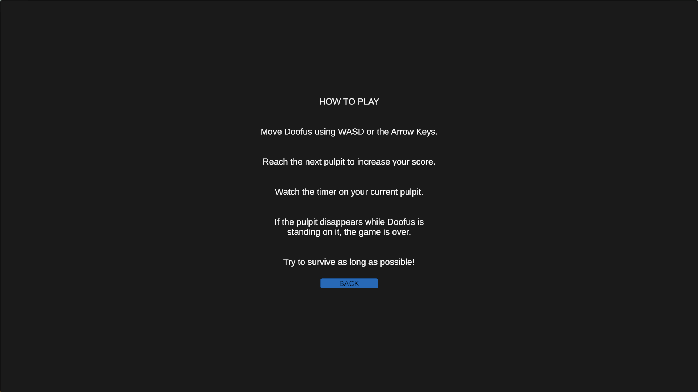
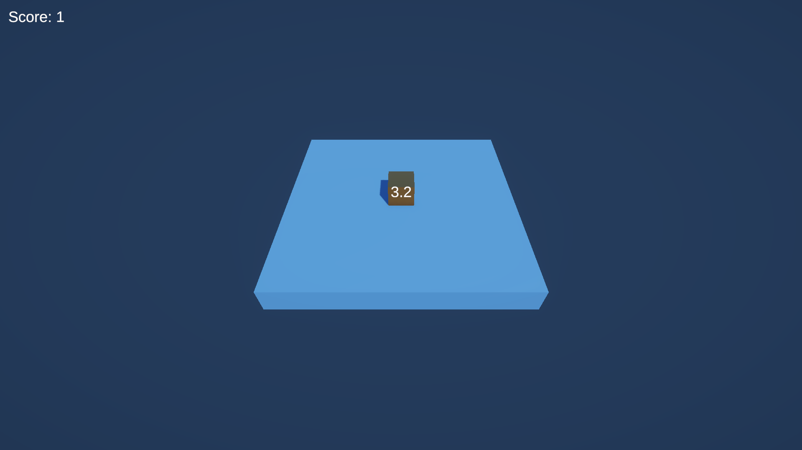
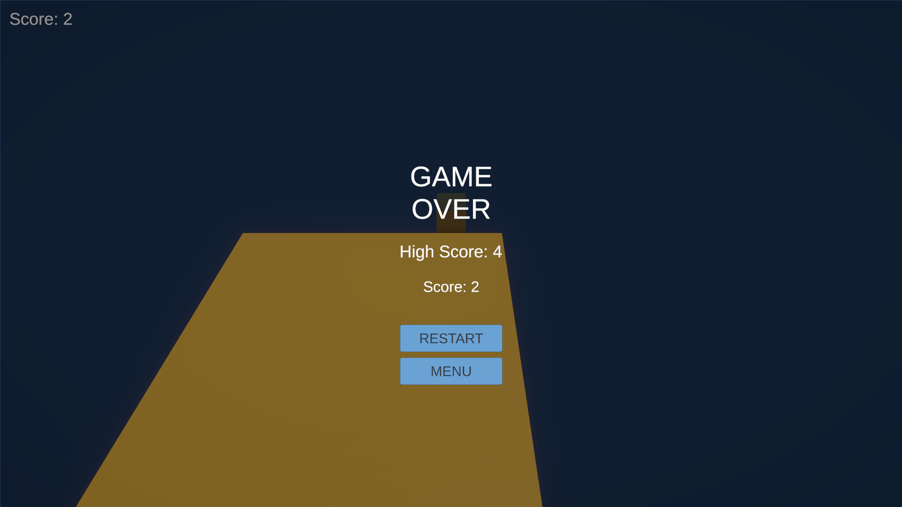

# 🎮 Doofus Adventure

> **A 3D platform-survival game built for the Hitwicket Game Developer Challenge 2026.**
>
> Guide Doofus from pulpit to pulpit, keep moving before the platform disappears, and survive for the highest score possible.

---

## ✨ Game Showcase

### 🎬 Gameplay

<video src="./Media/gameplay.mp4" controls width="900"></video>

[▶️ Watch / open the gameplay recording](./Media/gameplay.mp4)

### 📸 Screenshots

| Start Menu | How To Play |
|---|---|
|  |  |

| Gameplay | Game Over |
|---|---|
|  |  |

---

## 🕹️ About the Game

**Doofus Adventure** is a simple 3D platform-survival game. Doofus starts on a pulpit and must reach the next one before the current pulpit disappears.

Each pulpit has a countdown timer. The player has to read the situation, move deliberately, and reach the next platform in time. Falling between pulpits or remaining on a pulpit when it disappears ends the run.

The project was implemented in **Unity 6** with a lightweight 3D presentation, JSON-driven gameplay configuration, score/high-score handling, menu flow, and direction-aware procedural pulpit spawning.

---

## 🎯 Core Gameplay Loop

```text
        ┌───────────────┐
        │  Start Game   │
        └───────┬───────┘
                ↓
        ┌───────────────┐
        │ Stand on      │
        │ current pulpit│
        └───────┬───────┘
                ↓
        ┌───────────────┐
        │ Move toward   │
        │ next pulpit   │
        └───────┬───────┘
                ↓
        ┌───────────────┐
        │ Reach it and  │
        │ gain a point  │
        └───────┬───────┘
                ↓
        ┌───────────────┐
        │ Repeat before │
        │ pulpit expires│
        └───────┬───────┘
                │
          ┌─────┴─────┐
          ↓           ↓
       Survive      Fall / expire
          │           │
          ↓           ↓
     Higher score   GAME OVER
```

---

## ⭐ Features

- **WASD + Arrow Key movement**
- **JSON-driven gameplay values** through the Doofus Diary configuration
- **Timed pulpits** with configurable minimum and maximum destruction times
- **Countdown timer** displayed on the pulpit Doofus is currently standing on
- **Direction-aware pulpit spawning** — the next pulpit is generated relative to the previous pulpit instead of using completely random positions, making the challenge skill-based rather than purely luck-based
- **Maximum of two active pulpits** at a time
- **Score system** that rewards reaching a new pulpit
- **Persistent high score** across runs
- **Fall detection** when Doofus is no longer standing on a pulpit
- **Game Over detection** when the pulpit under Doofus disappears
- **Restart and Menu flows**
- **Start Menu + How To Play screen**
- **Color variation between pulpits**
- **Follow camera** for the gameplay view
- **Simple, readable UI** focused on gameplay rather than heavy visual effects

---

## 🎮 Controls

| Input | Action |
|---|---|
| `W` / `↑` | Move forward |
| `S` / `↓` | Move backward |
| `A` / `←` | Move left |
| `D` / `→` | Move right |

---

## ⚙️ Configuration

Gameplay values are stored in:

`Assets/Config/doofus_diary`

Current configuration:

```json
{
  "player_data": {
    "speed": 3
  },
  "pulpit_data": {
    "min_pulpit_destroy_time": 4,
    "max_pulpit_destroy_time": 5,
    "pulpit_spawn_time": 2.5
  }
}
```

Keeping these values outside the gameplay scripts makes the main gameplay parameters easy to tune without changing the core code.

---

## 🧩 Main Scripts

| Script | Responsibility |
|---|---|
| `DoofusController.cs` | Player movement, pulpit detection, scoring trigger, and fall detection |
| `PulpitController.cs` | Pulpit lifetime, countdown timer, and destruction handling |
| `PulpitSpawner.cs` | JSON-driven pulpit spawning and direction-aware placement |
| `ScoreManager.cs` | Current score and high-score handling |
| `GameManager.cs` | Game-over, restart, menu flow, and high-score state |
| `StartMenuController.cs` | Start menu and How To Play screen |
| `CameraFollow.cs` | Gameplay camera follow behaviour |

---

## 🗺️ Scenes

### `StartScene`

Contains the title screen and the main menu flow:

- **DOOFUS ADVENTURE** title
- **START** button
- **HOW TO PLAY** button
- Instructions screen
- **BACK** button

### `GameScene`

Contains the actual game loop:

- Doofus player
- Pulpits
- Timer
- Score display
- Pulpit spawning/destruction
- Game Over screen
- Restart / Menu buttons

---

## 🏗️ Assignment Implementation

### Level 1 — Character Movement & Platform Placement

Implemented player movement and pulpit behaviour using a JSON configuration file. Pulpits are spawned with controlled placement so that the player can make meaningful movement decisions rather than relying on impossible random jumps.

### Level 2 — Score System

The score increases when Doofus successfully moves onto a different pulpit. The best score is retained as the high score.

### Level 3 — Start & Game Over Screens

Implemented the complete menu flow:

- Start Menu
- How To Play
- Back navigation
- Game Over screen
- Restart
- Return to Menu
- High Score display

---

## 🧠 Difficulty Design

One important gameplay adjustment was made to avoid making the game **luck-based**.

A completely random next-pulpit position could occasionally create layouts that were effectively impossible to reach. Instead, the spawner places the next pulpit adjacent to the previous pulpit in a controlled direction.

This keeps the game challenging while ensuring that success depends primarily on **movement, timing, and decision-making**.

---

## 🛠️ Tech Stack

- **Unity 6**
- **C#**
- **Universal Render Pipeline (URP)**
- **TextMeshPro**
- **Unity Input System**
- **JSON / JsonUtility** for gameplay configuration
- **Git / GitHub** for version control

---

## 📁 Project Structure

```text
Assets/
├── Config/
├── Data/
├── Prefabs/
│   └── Pulpit
├── Scenes/
│   ├── StartScene
│   └── GameScene
├── Scripts/
├── Settings/
├── TextMesh Pro/
└── TutorialInfo/

Media/
├── screenshots/
│   ├── start-menu.png
│   ├── how-to-play.png
│   ├── gameplay.png
│   └── game-over.png
└── gameplay.mp4
```

---

## ▶️ Running the Game

### Option 1 — Play the Unity project

1. Open the project in **Unity 6**.
2. Open `Assets/Scenes/StartScene`.
3. Press **Play**.
4. Select **START** to begin.

### Option 2 — Run the Windows build

A Windows build can be generated from Unity's **Build Profiles** / **Build and Run** workflow.

Launch the generated `HW_2026_Test.exe` to play the standalone version.

---

## 🧪 Final Verification

The completed build was tested through the full gameplay flow:

- ✅ Start Menu
- ✅ How To Play screen
- ✅ Back navigation
- ✅ Player movement
- ✅ Pulpit spawning
- ✅ Direction-aware placement
- ✅ Pulpit countdown
- ✅ Pulpit destruction
- ✅ Score updates
- ✅ Fall detection
- ✅ Game Over flow
- ✅ High Score display
- ✅ Restart
- ✅ Return to Menu
- ✅ Standalone Windows build

---

## 📌 Notes

The game intentionally keeps the presentation simple and readable. The focus is on the gameplay loop, timing, movement, platform survival, and reliable menu/game-state behaviour rather than heavy UI effects.

---

## 👨‍💻 Project

**Doofus Adventure**  
Built for the **Hitwicket Game Developer Challenge 2026**.

**Developer:** Vijay Raghav Pant
